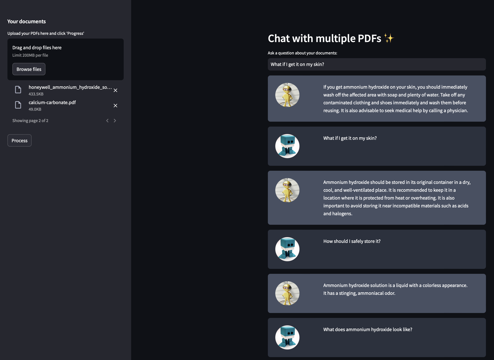
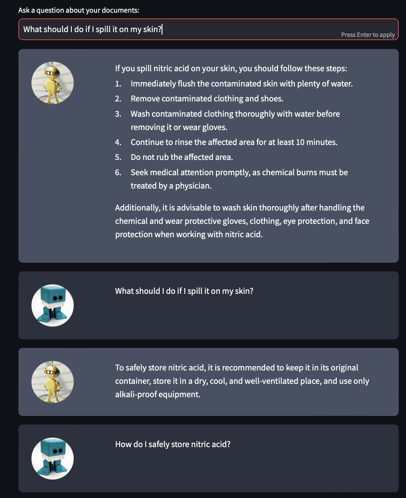
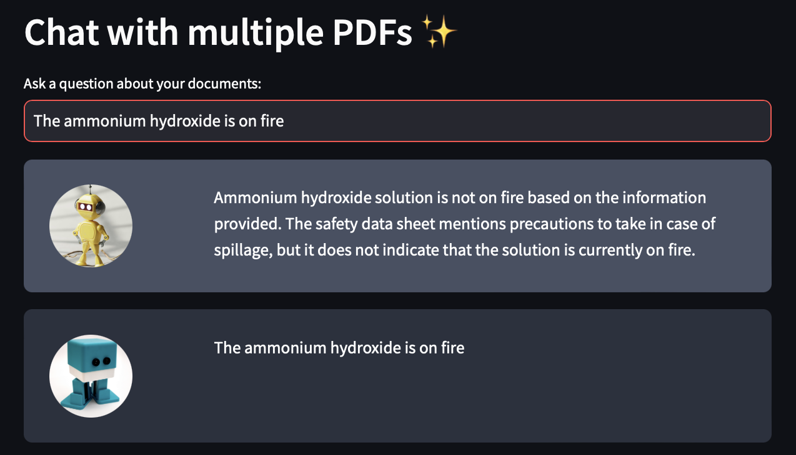
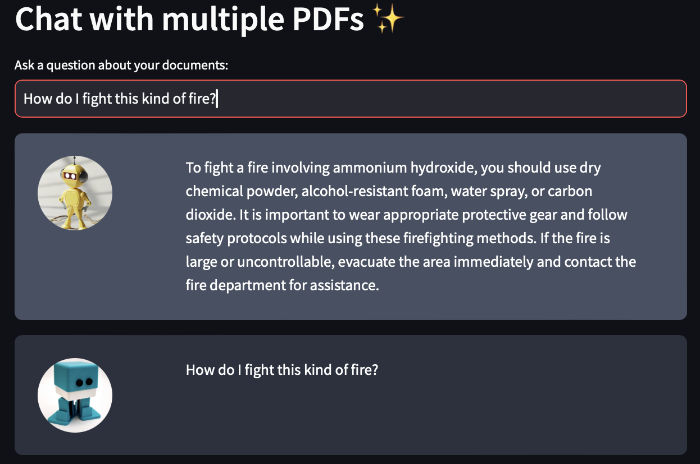
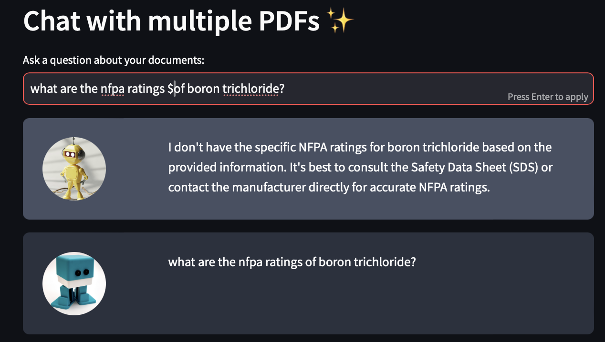

# 📋 Upload and 'Chat' With Multiple PDFs Using Langchain, Streamlit, and Open AI API

#### This project was developed by closely following a tutorial created by [Alejandro AO](https://youtu.be/dXxQ0LR-3Hg?si=sIJWJZCsgKfmbiyA).  While the resulting code closely resembles the tutorial's implementation, it was built independently rather than cloning Alejandro's code.  This approach allowed for a deeper understanding of the code structure and functionality.

## Background & Purpose
---
As someone with a background in chemistry, I'm well aware that laboratories typically maintain an extensive library of Standard Operating Procedures (SOPs). These SOPs outline numerous processes and protocols, often numbering in the dozens. Moreover, when it comes to chemical-specific SOPs, the count can easily reach into the hundreds or even thousands.

The sheer volume of these documents presents a significant challenge: locating and reviewing a specific SOP can be incredibly time-consuming. This issue isn't unique to chemistry labs; any organization with a large SOP library faces similar difficulties in efficiently accessing and utilizing their procedural documentation. This situation highlights a common problem across various industries and sectors: as the number of SOPs grows, so does the complexity of managing and retrieving this critical information when it's needed most.

This project leverages a combination of Langchain, the OpenAI API, and Streamlit to develop an interface that allows users to upload PDFs and query their contents in a chatbot-like manner. The application also retains a history of interactions, enabling it to remember and iterate on previously asked questions.

## Sources
* [Chat With Multiple PDFs | LangChain App Tutorial in Python (Free LLMs and Embeddings](https://www.youtube.com/watch?v=dXxQ0LR-3Hg)
* [Python Environments In VS Code](https://code.visualstudio.com/docs/python/environments)
* [The Streamlit Community](https://discuss.streamlit.io/)
* [OpenAI API Developer Quickstart](https://platform.openai.com/docs/quickstart)
* [LangChain With Python](https://python.langchain.com/v0.2/docs/introduction/)

## Roadblocks
---
#### Environment Setup

This project was developed using VS Code on macOS, marking a shift from my previous PC-based JupyterLab projects. Initial challenges with Streamlit displaying a blank screen led to valuable learning experiences:

* Setting up virtual environments
* Specifying Python versions
* Installing packages within the environment

After addressing these issues, I successfully ran a basic local Streamlit app on Safari.  This process improved my ability to work through problems and deepened my understanding of virtual environments in VS Code.

#### Adapting to Library Changes

The tutorial I followed was created in 2023, leading to compatibility issues with current library versions. Challenges included:

* Updated import methods in LangChain
* Tested various input methods
* Adapted the code to work with latest library versions

These adjustments provided insight into how Python libraries change and evolve.

#### Integrating OpenAI API

As this was my first time working with the OpenAI API, I had to research and learn how to set it up correctly. This involved:

* Creating an OpenAI account
* Obtaining and securely store an API key
* Implementing the API in code
* Managing API usage and costs

This process added complexity to my project, requiring me to learn best practices around working with third-party APIs and managing secure credentials.

### Results & Shortcomings

The results looks promising, but with room for improvement.

The images above demonstrate a successful interaction with the chatbot, showcasing its ability to answer various questions about a specific chemical. The chatbot provides information on the chemical's appearance, safety measures for skin contact, and proper storage methods. Notably, the bot exhibits memory of previous queries, as evidenced by the user's need to mention the chemical only once throughout the conversation. This context retention allows for a more natural and efficient dialogue

n some instances, however, the chatbot's performance fell short of expectations. The images below illustrate a scenario where the chatbot misinterpreted a user's statement about ammonium hydroxide being "on fire." Instead of recognizing this as a urgent situation requiring immediate action, the chatbot took the phrase literally, failing to address the appropriate emergency response.

When the user followed up by specifically asking how to fight this type of fire, the chatbot then provided a more practical and relevant answer. This exchange highlights the importance of clear communication and the potential limitations of AI in understanding context or urgency in certain situations. It also demonstrates how rephrasing a question can sometimes lead to more accurate and helpful responses from the chatbot.

Another example of the chatbot's shortcomings occurred when a user requested the NFPA ratings for a specific chemical. These ratings are standard information typically found in a safety data sheet (SDS). Surprisingly, instead of providing the requested information, the chatbot advised the user to consult the safety data sheet. This response was particularly problematic because the SDS was the very document that had been processed and incorporated into the chatbot's knowledge base.

### Conclusion

Following the tutorial, I successfully created a chatbot capable of processing and responding to questions about multiple PDF documents. This project introduced me to VS Code and LangChain, two tools I hadn't previously worked with. The experience has increased my comfort level with using VS Code in a Mac OS environment.

Although the chatbot's responses don't always meet my expectations in terms of accuracy or completeness, I see potential in this application. The project has been a valuable learning experience, enhancing my skills in troubleshooting on the fly and working with new development tools.

Despite its current limitations, I believe this chatbot could be developed into a viable application with further refinement. The process has not only expanded my technical knowledge but also given me hands-on experience in creating practical AI-driven solutions.